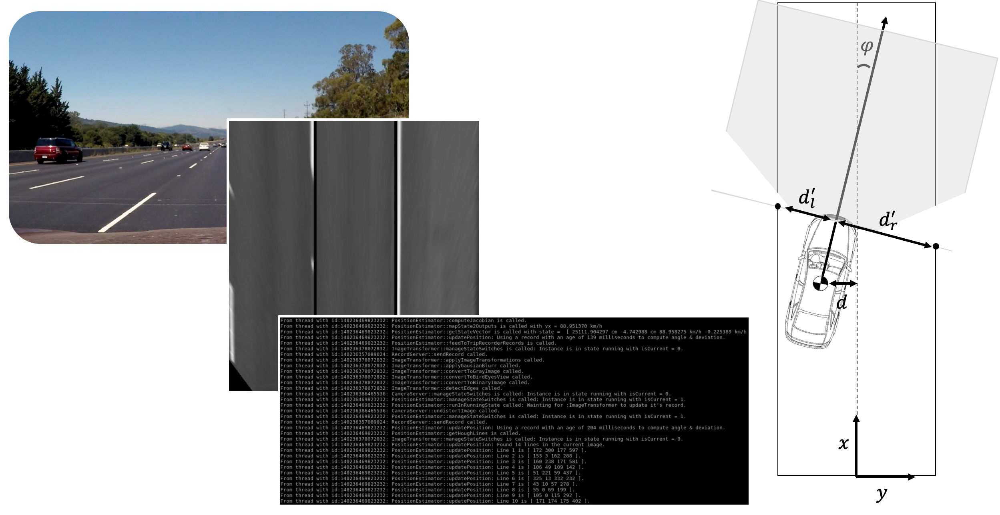

# Camera-based Vehicle-Position-Estimation



This is my capstone project in Udacity's C++ Nanodegree Program. This project contains an application that estimates the position of a road vehicle as it travels on a highway. The application generates an estimate of the state of the vehicle that may be fed to a driver assistant system or may be part of an autonomous driving system: An extended Kalman Filter estimates the position on the road and the velocities using "measurements" taken from a simple camera image. The architecture of this application is service-oriented, suitable for (Ubuntu) Linux and uses OpenCV and the Eigen-Library.

The application is shipped with sample images and sample videos for

* static testing of the Extended Kalman Filter (EKF), e.g. with perfectly centered vehicle and ideal light to extract lane lines without much "noise in the computer vision"
* calibration of the camera - all meta-parameters are tuned with the set of images shipped with this repository
* dynamic testing and validation of the performance of the EKF with real-world data in a save (cloud or desktop) Ubuntu-Linux Environment

When cloning the repository, the application is "wrapped" in a harness that stimulates it with images and vehicle velocity signals. If someone wants to use the application in a real vehicle the image source (see the aptly named class in CameraServer.h) and the velocity source (see the aptly named class in CameraServer.h) must be adapted: Both are individual classes with well-defined interfaces that can be easily tweaked to consume from real imaging hardware drivers and vehicle network communication stacks like classic or adaptive [AUTOSAR](https://www.autosar.org//). Hence the application is very suitable for re-use. 

The use-case implemented here (and ready to try at home!) is to test the EKF with Software-in-the-Loop, after shooting images or videos on the raod and postprocess in a save manner off-line on a desktop- or cloud-hosted Ubuntu Linux. Hence: The input for the application here is an image (filetype: jpg, used for static simualtion) or a video (filetpe: mp4, used for dynamic simulation). These artifacts are defined by the user and passed at the command line. The output of the application is a result file (aptly named "result.txt") that appears in the folder the executable is located in after the off-line simualtion run. The file holds the simulation/recorded time, the estimated state (x-position, y-position, x-velociyt, y-velocity), the angle and the "measurements" made in the camera image using image processing methods (see the title figure for coordinates and definition of the angle). All quantities are saved to file in SI-Units (metres, seconds, metres/second,...).

Note: The system is linear in the state difference equations, but non-linear in the measurement equations, hence an Extended Kalman Filter is needed to track the state. Find the details in the sections below.

## Dependencies for Running Locally
This section lists the dependencies of the application &amp how to get them.

* cmake >= 2.8
  * All OSes: [click here for installation instructions](https://cmake.org/install/)
* make >= 4.1 (Linux, Mac), 3.81 (Windows)
  * Linux: make is installed by default on most Linux distros
  * Mac: [install Xcode command line tools to get make](https://developer.apple.com/xcode/features/)
  * Windows: [Click here for installation instructions](http://gnuwin32.sourceforge.net/packages/make.htm)
* OpenCV >= 4.1
  * The OpenCV 4.1.0 source code can be found [here](https://github.com/opencv/opencv/tree/4.1.0)
* gcc/g++ >= 5.4
  * Linux: gcc / g++ is installed by default on most Linux distros
  * Mac: same deal as make - [install Xcode command line tools](https://developer.apple.com/xcode/features/)
  * Windows: recommend using [MinGW](http://www.mingw.org/)
* Eigen-Library
  * Linux: Run chmod u+x installEigenLibrary.sh && ./installEigenLibrary.sh 

## Basic Build Instructions
This section explains how to build and deploy the application.  

1. Clone this repo.
2. Change the directory to the build directory: `cd build`
3. Compile: `cmake .. && make`
4. Run it: `./CBPE relative-path-to-video-or-image-file`, e.g. `./CPBE test/test02.jpg`

Note: CBPE is the short form for *Camera-based Position Estimation*.

## Running the Application
The application can be run by calling it with a relative path to a suitable video or a relative path to a suitable image.
Suitable images and videos are part of this repository:

* Find suitable images in /build/test, e.g. test/test01.jpg
* Find suitable videos in /build/, e.g. video01.mp4

The application runs in a multi-threaded mode when parsing a suitable video, otherwise it runs in a single-threaded mode. Parsing a suitable image is usefull to test convergence of the filter with "perfect" road images.

At the end of each simulation run, a file is created, the "results.txt". Here, the user can find 

* simulation time
* the estimate of the state: position x on the road, position y on the road, velocity in x-direction, velocity in y-direction.
* the angle between road center line and the direction the vehicle is heading
* the "measurements" made in the camera image after transformations

This file can be fed into MATLAB or Python/Numpy for further visualization, e.g. to study how close the driver was following the track.

### Running the Application with a Suitable Image
To run with a suitable image, switch to /build/ and

```
./CBPE test/test02.jpg
```

A trip is simulated assuming the same image appears again and again in the camera of the vehicle. 
Find the resulting record of this trip in the same directory as the application: results.txt
Note: Roughly constant vehicle velocity is assumed, as defined in main.cpp:

```cpp
#define MEANVELOCITY 88 // km/h
#define VARIANCEVELOCITY 5 // km/h
```
The application stops and displays a picture similar like the one shown below.


The image shows the "Bird Eye's View" of the orignal image provided at the command line with lane lines in black. If you do not see lane lines, no lane lines have been found. 
Note: The Kalman Filter only updates only if either left- or right-hand-side lane lines can be found in the image. 

### Running the Application with a Suitable Video
To run with a suitable image, switch to /build/ and

```
./CBPE video01.jpg
```

A trip is simulated drawing video frames at a constant frequency. This is simulating the camera of the vehicle. 
Find the resulting record of this trip in the same directory as the application: results.txt
Note: Roughly constant vehicle velocity is assumed, as defined in main.cpp:

```cpp
#define MEANVELOCITY 88 // km/h
#define VARIANCEVELOCITY 5 // km/h
```

When submitting a video to the application, the Runtime of the simualtion must be chosen shorter than the length of the video (sorry: I did not build in a stop-request when the video stream stops, so an exception will be thrown when the application runs for too long); the runtime can be parameterized in the main.cpp here:

```cpp
#define RUNTIME 15000 // ms
```
Note: The many different threads launched are visible in the command window - the application is configured with very verbose logging to allow for debugging.
 
## How are Udacity's Capstone Project Requirements met?
Udacity's [C++ Nanodegree](https://www.udacity.com/course/c-plus-plus-nanodegree--nd213) has an "open" capstone project, so students invent an application from scratch that must meet a set of non-functional goals. They are listed below together with the way I chose to meet them.

### Goals for the README.md
Satisfaction of these goals shows that the author of the application is able to compile a reasonable documentaion and commit it to a public repository.

| Goal          																	| Goal is met by    
| ----------------------------------------------------------------------------------| -------------------------------------------------
| A README with instructions is included with the project   						| This is the README.md.
| The README indicates which project is chosen.   									| I choose to write my own application from scratch.
| The README includes information about each rubric point addressed.				| Each point is addressed in this section.		

### Goals for the Compiling and Testing
Satisfaction of these goals shows that the author of the application is able to set up CMAKE for a C++-Project and ship an executable.

| Goal          																	| Goal is met by    
| ----------------------------------------------------------------------------------| ----------------------------------------------------------------------
| The submission must compile and run.  											| Follow basic build instructions on a machine that has all dependencies.

### Goals for Loops, Functions and I/Os
Satisfaction of these goals shows that the author of the application is able to decompose problems into loops and functions that interact with the user (at least over the command line interface).

| Goal          																	| Goal is met by    
| ----------------------------------------------------------------------------------| -------------------------------------------------
| The project demonstrates an understanding of C++ functions and control structures.| Conditions and loops can be found in every class.
| The project reads data from a file or the program writes data to a file.			| Application reads the intrensics.xml & image/video-files and writes the "results.txt" at the end of the run.
| The project accepts user input and processes the input.							| User provides a video- or image-file with command line input

### Goals for Object-Oriented Programming
Satisfaction of these goals shows that the author of the application is able to decompose an abstract problem into classes that work together to provide a solution.
| Goal          																	| Goal is met by    
| ----------------------------------------------------------------------------------| -------------------------------------------------
| The project uses Object Oriented Programming techniques.							| The application is organized in classes that can be tested individually.
| Classes use appropriate access specifiers for class members.  					| When necessary I added getter's and setter's.
| Class constructors utilize member initialization lists.							| When this is possible it is realized, see e.g. RunnableEntity.cpp.
| Classes abstract implementation details from their interfaces.					| (Public) Interfaces of my classes have meaning full names that tell what they do, further documentation is in the header file.	
| Classes encapsulate behavior.														| PositionEstimator.h encapsules the Kalman Filter, CameraServer encapsules aquisition of images and merging them with the velocity,...	
| Classes follow an appropriate inheritance hierarchy.								| RunnableEntity.h is the mother to CameraServer.h, ImageTransformer.h, PositionEstimator.h and PositionServer.h	
| Overloaded functions allow the same function to operate on different parameters.	| Constructors of PositionEstimator.h and CameraServer.h operate with different number of arguments.
| Derived class functions override virtual base class functions.					| Childrens of RunnableEntity.h must implement the "run"-method. E.g. is PositionServer.h
| Templates generalize functions in the project.									| MovableTimestampedType.h is a template that I used to create movable data-structures that track their "age".

### Goals for Memory Management
Satisfaction of these goals shows that the author of the application is able to manage the memory and respect the rule of five.

| Goal          																	| Goal is met by    
| ----------------------------------------------------------------------------------| -------------------------------------------------
| The project makes use of references in function declarations.						| See, e.g. PositionEstimator.h, line 37.
| The project uses destructors appropriately.  										| See MovableTimestampedType.h and CameraServer.h (see ImageSource, the destructor closes the video-file)
| The project uses scope / RAII where appropriate.									| PositionServer.h holds & manages the other classes (with smart pointers).	
| The project follows the Rule of 5.												| See MovableTimestampedType.h 
| The project uses move semantics instead of copying data, where possible.			| See examples for application of move-semantics in RecordServer.h, sending the record is done by moving it.	
| The project uses smart pointers instead of raw pointers.							| EPositionServer.h holds & manages the other classes (with smart pointers).		

### Goals for Concurrency
Satisfaction of these goals shows that the author of the application is able to create multi-threaded programms that utilize processing power of contemporary hardware well.

| Goal          																	| Goal is met by    
| ----------------------------------------------------------------------------------| -------------------------------------------------
| The project uses multithreading.				| When running with video, execution is mamaged by PositionServer. This manages multiple threads and controls the execution by sending the desired modes to PositionEstimator, CameraServer and ImageTransformer. The many different threads launched are visible in the command window (the application is configured with verbose logging).
| A promise and future is used in the project. 										| See RecordServer.h, which is a mother class of e.g. CameraServer.
| A mutex or lock is used in the project.								| See RecordServer.h, which is a mother class of e.g. CameraServer.	
| A condition variable is used in the project.												| See RecordServer.h, which is a mother class of e.g. CameraServer.

## Functional Requirements of the Application
The following requirements hold:
* **REQ-ID00**: The position of the vehicle on the road must be updated when a new image becomes available at the source of images of the road in front of the vehicle.
* **REQ-ID01**: The application must support external start, freeze and termination to be launched and terminated depending on the situation of the raod vehicle (e.g. when off-highway in a suburban area with very curvy roards).
* **REQ-ID02**: An image of the road in front of the vehicle must be read from an image source and at the same time the vehicle velocity must be captured. These two entities must be saved in a structure at the same time.
* **REQ-ID03**: An image of the road in front of the vehicle must be undistorted before it is used in downstream image processing.
* **REQ-ID04**: The undistorted image must be used to detect lanes in the image.
* **REQ-ID05**: If lanes can be detected in the image, the distance to the center line of the road and the angle of the vehicle w.r.t. the center line of the road must be computed.
* **REQ-ID06**: Distances and angles computed from images of the road in front of the vehicle must not be used directly by clients of this service; they must but fed into a filter minimizing the effects of noise, processing time and uncertainty in the accuracy of the image processing algorithm. Clients of this service consume the estimated state only.
* **REQ-ID07**: The trip must be recorded in a file; the file must contain the estimated state, the timestamp and the distances & angles computed with image processing to arrive at the state estimate.

## Architecture & Mapping of Requirements to Software
In the figure below a class diagram of the application is shown. The core software components that require attention are: CameraServer, ImageTransformer, PositionEstimator and PositionServer.


The following relationship between software components and requirements holds:

| Software Component       		| Requirements addressed   
| ------------------------------| ----------------------------
| PositionServer			    | REQ-ID00, REQ-ID01
| CameraServer				    | REQ-ID02, REQ-ID03
| ImageTransformer			    | REQ-ID04
| PositionEstimator			    | REQ-ID05, REQ-ID06, REQ-ID07

The **PositionServer** abstracts the details and hence provides the service to the terminal customer. It provides interfaces to initialize, run and stop ("terminate") the application. The PositionServer creates instances of a *CameraServer*, an *ImageTransformer* and a *PositionEstimator* and launches necessary threads. When the customer switches to the "initialize"-state, from the "initialize"-state to the "run"-state or from the "run"-state to the "terminated"-state, PositionServer controls the execution by imposing states on individual software components - in the right order. 

The **CameraServer** pulls an image from the mounted image source (here: an image or a sequence of frames pulled from a video), merges it with the velocity signal, undistorts the image and puts all reuslts in movable record that features tracking of it's age - the age is needed later when running the Extended Kalman Filter. The movable record is created in a thread-safe manner until it is pulled by the next consumer in line, the *ImageTransformer*.

The **ImageTransformer** pulls the movable record and uses the undistorted image from the mounted CameraServer in a sequence of image processing operations to arrive at the binary bird eye's view. The intermediate results are added to the movable record without rendering the age of the record (for debugging or saving them as a video later). With the binary bird eye's view being ready, the movable record is waiting to be pulled by the next consumer in line in a thread-safe manner, the *PositionEstimator*.

The **PositionEstimator** consumes movable record and uses the binary bird eye's view to determines angles & distances to the center of the lane in the image. The core operation here is the Hough-Transformation: Given a set of meta-parameters, lines in the image are identified as lane lines. Using trigonomoetric functions, one can derive the distance to the center lines and angle of the road vehicle.
This software component is responsible to schedule the Extended Kalman Filter (EKF, see the literature cited) with the correct simulation time and provide it with the right "measurments" - if there are any: The Hough Transformation might not always deliver a lane line, there might be too much "noise in the computer vision" or artifacts that may lead to false assumptions on distances like trailers being identified as lane lines. The correct simulation time is derived from the age of the movable record: The time it takes from it's initial creation to consumption of "measurments" in the EKF. This may vary due to processor load and can be observed in the command line output (we are not running on an RTOS giving fixed execution times!). The EKF handles this by adapting the timestep in the prediction-phase of the algorithm. 
This software component also tracks the trip: It holds a vector of state vectors and "measurements" that must be saved to disc at the end of a trip (here: end of a simulation) for further analysis. The result-file ("results.txt" is found in the build-folder) is a convenient csv-file.

## The Mechanics of the Producer-Consumer-Middleware
This application implements a service-oriented, "producer-consumer"-middleware. It is realized by **RecordServer** using a condition variable and a mutex to protect access to the object of interest: The movable record containing images, states and measurements.

## The Extended Kalman-Filter for Tracking the State of the Road Vehicle
The EKF is implemented completely in **PositionEstimator**. Those who are familiar with the matter will recognize the equations in PositionEstimator.cpp, like the *prediction*-step:

```cpp
void PositionEstimator::predict(const float timestep){
  ...
  computeStateTransitionMatrix(timestep);
  computeProcessCovariancenMatrix(timestep);
  x = A * x;
  Eigen::MatrixXd At = A.transpose();
  P = A * P * At + Q;
}
```

and the *update*-step:

```cpp
void PositionEstimator::update(const Measurement& measurement){
  ...
  z = Eigen::VectorXd(3);
  z << measurement.deviation, measurement.angle, measurement.velocity;
  Eigen::MatrixXd H(3, 4); // TO DO
  H = computeJacobian(x);
  Eigen::MatrixXd R(3, 3);
  R << deviationVariance, 0,  0, // variance in deviation (m)
       0, angleVariance, 0, // variance in angle (rad)
       0, 0, velocityVariance; // variance in velocity (m/s)
  Eigen::VectorXd y = z - mapState2Outputs(x);
  ...
  Eigen::MatrixXd Ht = H.transpose();
  Eigen::MatrixXd S = H * P * Ht + R;
  Eigen::MatrixXd Si = S.inverse();
  Eigen::MatrixXd K = P * Ht * Si;
  x = x + (K * y);
  int dimension_of_x = x.size();
  Eigen::MatrixXd I = Eigen::MatrixXd::Identity(dimension_of_x, dimension_of_x);
  P = (I - K * H) * P;
}
```
The derivation of these equations are left to the literature cited. Here we quickly go through the state equations and the measurement equations.
A reoad vehicle with front camera (usually hidden behind the central mirror) is considered as displayed below.


In the following the road is considered *locally* straight. This is a save assumptions on most highways. Exceptions are ramps. So when approaching a ramp, the application must be stopped or freezed (hence, the external interfaces provided by PositionServer!) and moved back to the running-state when assumptions are met again. The assumption of a *locally* straight lane with lane lines translates into a model that might be visualized like below.


The gray part of the image above resembles the bird eye's view that can be computed with OpenCV's image processing library; it shows that part of the road is visible "from above". Very close to the bottom of the transformed image the distortion is low and one can use the points where the lane lines intersect with the bottom to determine

* the distance to the center of the lane, knowing the road width (12 feet in the US)
* the angle the vehicle is heading w.r.t. the center line of the road

What a driver (or autonomous driving system) will do is to steer the vehicle "into the zero" - zero deviation from center line and zero angle between where the vehicle is heading and the center line. Hence it is of interest to determine the state - position and velocity of the road vehicle - and feed this back to either the driver or an auto-pilot at a reasonable rate.

## Literature cited
[1] D. Simon, Optimal State Estimation: Kalman, H Infinity, and Nonlinear Approaches, find it [here](https://www.amazon.de/Optimal-State-Estimation-Nonlinear-Approaches/dp/0471708585/ref=asc_df_0471708585/?tag=googshopde-21&linkCode=df0&hvadid=310939520557&hvpos=&hvnetw=g&hvrand=11109297407473148806&hvpone=&hvptwo=&hvqmt=&hvdev=c&hvdvcmdl=&hvlocint=&hvlocphy=9042503&hvtargid=pla-466802268421&psc=1&th=1&psc=1&tag=&ref=&adgrpid=61876418295&hvpone=&hvptwo=&hvadid=310939520557&hvpos=&hvnetw=g&hvrand=11109297407473148806&hvqmt=&hvdev=c&hvdvcmdl=&hvlocint=&hvlocphy=9042503&hvtargid=pla-466802268421)
